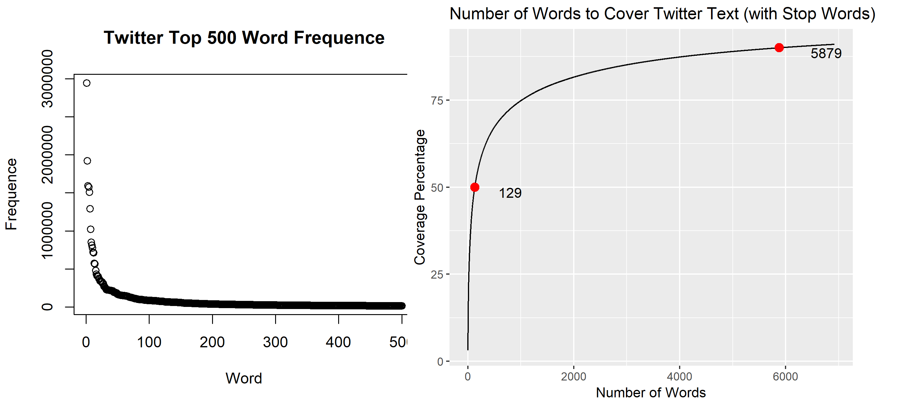

Coursera Data Science Capstone
========================================================
author: Wenjing Liu
date: 2019-04-23
autosize: true

1. Data Cleanse
========================================================

- Covert all letters to lower-case;
- Remove strings with "http://", "https://", begin with @, etc;
- Replace all non alphanumeric letters with space;
- Remove excessive spaces;
- Split text at space to get 1-gram dictionary.

Or we could use libraries to tokenize the text (omitting stopwords). For twitter text we could use function tokenize_tweets().


```r
library(tokenizers)
library(stopwords)
tokenize_words(<text>, stopwords=stopwords::stopwords("en"))
```

For More info: https://cran.r-project.org/web/packages/tokenizers/vignettes/introduction-to-tokenizers.html

2. N-gram Dictionary
========================================================

Get 2-grams and 3-grams (with stopwords).


```r
tokenize_ngrams(<text>, n_min=2, n=3)
```

To reduce the N-gram dictionary size, first calculate frequency for each N-gram, then abandon the least frequent ones (the long tail), say the ones only cover 10% of occurrences or the ones that only appear once in the text corpus. 

E.g. The total count of 1-gram is around 540,000. We would only need 6,000 words to cover 90% of the occurrences. 

3. Exploratory Analysis
========================================================

Use Twitter text as an example.



4. Shiny UI
========================================================

The Shiny app uses no-tail 3-gram dictionary (ommiting 3-grams that appears only once in the text corpus). It will match the last two words of an text input with the first two words of entries in the dictionary, to predict the third word. If no entries found, it will try to match the last word of the input only. If no entries found again, it will return the most frequent 3-grams as result.

You can launch the app:

- online by visiting https://wenjing.shinyapps.io/app-text-input-v2/;
- or locally by running the following code in your RStudio.


```r
library(shiny); runGitHub( "Shiny-Text_Input_Prediction-V2", "Nov05")
```

5. Statictics
========================================================

There are around 54,000 1-grams (different words) in total. And the no-tail 3-gram dictionary has about 4,060,000 entries, the count of unique first word of 3-grams is around 540,000. 

- Hence 53766/537782 = 10% words of the text corpus is covered.

The sum of the 1-gram occurencies is 68064165. The sum of that covered by the 3-gram first words is .

- Hence /68064165 = word occurencies is covered.


